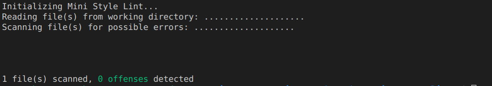
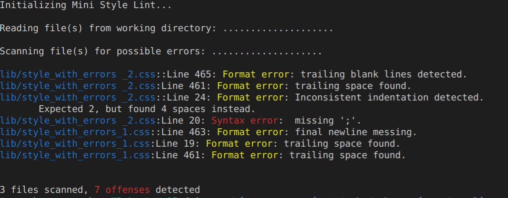

# CSS Linter

[](https://github.com/temesghentekeste/css-linter/pulls)
[](https://github.com/temesghentekeste/css-linter/issues)
[](https://github.com/temesghentekeste/css-linter/pulls)

## Content

<a text-align="center" href="#about">About</a>&nbsp;&nbsp;&nbsp;|&nbsp;&nbsp;&nbsp;
<a href="#description">Description</a>&nbsp;&nbsp;&nbsp;|&nbsp;&nbsp;&nbsp;
<a href="#screenshots">Screenshots</a>&nbsp;&nbsp;&nbsp;|&nbsp;&nbsp;&nbsp;
<a href="#ins">Installing</a>&nbsp;&nbsp;&nbsp;|&nbsp;&nbsp;&nbsp;
<a href="#with">Built with</a>&nbsp;&nbsp;&nbsp;|&nbsp;&nbsp;&nbsp;
<a href="#setup">Setup</a>&nbsp;&nbsp;&nbsp;|&nbsp;&nbsp;&nbsp;
<a href="#ldl">Live Demo</a>&nbsp;&nbsp;&nbsp;|&nbsp;&nbsp;&nbsp;
<a href="#gandb">Code examples</a>
<a href="#author">Author</a>


## About <a name = "about"></a>
This project is a capstone project developed as a completion of Ruby section of Microverse main curriculum. It is a css lint tool intended to showcase Ruby programming Skills. The project has also been enhanced by adding Rspec tests to check each and every method written works as it was intended

<h3>Description <a name = "description"></a></h3>
<h4>This tool provides useful css practices detecting the folllowing errors:</h4>
<li>Empty line at the end of the css file(s)</li>
<li>Unnecssary trailing spaces at the end of lines in a css file(s).</li>
<li>Missing space before opening curly bracket</li>
<li>Inconsistent indentation</li>
<li>Missing semicolon</li>

## Screenshots <a name = "screenshots"></a>
### Screenshot of linter passing with no errors
 

### Screenshot of linter displaying errors


## 🔧 Built with<a name = "with"></a>

- Ruby 2.7.0
- Rspec gem
- Colorize gem


## 🔴 Live Demo <a name = "ldl"></a>


**Click [here](https://www.loom.com/share/184bb24d5a5e4c938ab5a1abcdc7f9e7) in order to see a Live Demo of this project.**


## 🔨 Setup<a name = "setup"></a>

- Fork the repo to your remote repository.
- Clone or download the repository to a local directory on your computer.
- To make the ministylelint file executable, using your terminal go to the project directory in your local machine and run the following commands
  - cd css-linter/bin (changes directory into the bin folder)
  - sudo chmod 755 ministylelint (this command adds execute permissions to the file)
  - ln -s $PWD/ministylelint /usr/local/bin  (this creates a softlink, or an alias in OS X terms and enables you to run the file without prefixing it with the ruby command )
- To use the tool, run the following commands:
   - ministylelint &lt;filename&gt; Eg: ministylelint styles/style_without_error.css and this checks only the specified file
   - ministylelint (this checks all the css files in the working directroy)
   - For quick test, run the following commands
      - ministylelint styles/style_with_errors_1.css 
  - If all fails
      - you should be in the root directory of the project and run these commands
      - ruby bin/ministylelint styles/style_without_error.css (to check one file)
      - ruby bin/ministylelint (to check multiple files)

## 🛠 Installing <a name = "ins"></a>

- The following command works if you have ruby and bundler installed in your machine.
   - bundle install

## Good and Bad code examples<a name = "gandb"></a>
##### Good Code example
Here is an example of good code with correct usage of syntax, spaces and indentation.
```
.newsletter-signup {
  font: bold 18px/18px 'Roboto Condensed', sans-serif;
  padding: 20px;
  background-color: #f4f5f6;
  max-width: 300px;
  margin: 0 auto 30px;
}
```
##### Bad Code example -empty line at the end of the css file(s) 
```
.newsletter-signup {
  font: bold 18px/18px 'Roboto Condensed', sans-serif;
  padding: 20px;
  background-color: #f4f5f6;
  max-width: 300px;
  margin: 0 auto 30px;
}


```
##### Bad Code example -missing semicolon
```
.newsletter-signup{
  font: bold 18px/18px 'Roboto Condensed', sans-serif;
  padding: 20px;
  background-color: #f4f5f6
  max-width: 300px;
  margin: 0 auto 30px;
}
```

## 🔨 Testing

To run the tests described for each method:
- change directory to the root of the project (cd into the project folder)
- from terminal run the command `rspec`
- to run a specific test `rspec ./spec/space_scan_spec.rb:70` (here 104 is the line number of the method)
- result should be similar to:
<h4>SpaceScanner</h4>
<h4>#space_before_curly_bracket_scan</h4>
  <li>should return nil if there is a space before the opening curly bracket.</li>
  <li>should return an error message if there is a space before the opening curly bracket</li>
<h4>#trailing_space_scan</h4>
  <li>should return an error messages if there is a trailing space.</li>
  <li>should return nil if there is no trailing space</li>
<h4>#last_line_scan</h4>
  <li>should return nil if the last line is blank.</li>
  <li>should return error message if the last line is missing</li>
  <li>should return error message if the last line has more than one trailing blank line</li>
  <h4>#indentation_scan</h4>
  <li>should return an error messages if there is inconsistent indentation</li>
  <li>should return nil if there is no inconsistent indentation</li>
<h4>SyntaxScanner</h4>
<h4>#missing_semicolon_scan</h4>
   <li>should return error message if there is missing simicolon</li>
   <li>should return nil if there is no missing simicolon</li>


## ✒️  Author <a name = "author"></a>


👤 **Temesghen Tekeste**

- Github: [@temesghentekeste](https://github.com/temesghentekeste)
- Twitter: [@temesghentekes1](https://twitter.com/temesghentekes1)
- Linkedin: [temsghen-tekeste-bahta-8b5243193](https://www.linkedin.com/in/temesghen-tekeste-bahta-8b5243193/)


## 🤝 Contributing

Contributions, issues and feature requests are welcome!

Feel free to check the [issues page](https://github.com/temesghentekeste/css-linter/issues).


## 👍 Show your support

Give a ⭐️ if you like this project!

## :clap: Acknowledgements
- <a href="https://www.microverse.org/" target="_blank">microverse.org</a>
- <a href="https://www.theodinproject.com/" target="_blank">The Odin Project</a>
</div>
